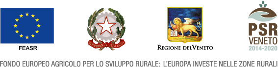

Introduzione
==================

Credits
------------------------------------------

https://psrveneto.it/

Il Plugin CHM from LIDAR è stato finanziato dal Programma di sviluppo rurale per il Veneto 2014-2020 

Organismo responsabile dell’informazione: GTER Innovazione in Geomatica, GNSS e GIS 

Autorità di gestione: Regione del Veneto - Direzione AdG FEASR e Foreste 

Il Manuale è stato realizzato da `Gter srl`_  e distribuito con licenza https://creativecommons.org/licenses/by/4.0/

**Per gli utenti di Regione Veneto** è stato inoltre realizzato un tutorial dettagliato sull'utilizzo dei dati LIDAR a fini forestali in QGIS. Il tutorial (in italiano) comprende:

* una breve sezione introduttiva sulla tecnologia LIDAR e le sue principali applicazioni in ambito ambientale e non solo, 
* una dettagliata descrizione dell'utilizzo e funzionamento del Plugin CHM from LIDAR con esempi pratici basati sui dati (DSM/DTM) di Regione Veneto
* una sezione dedicata al post-processamento dei CHM ottenuti dall'utilizzo del plugin (es. riclassificazione e successiva vettorializzazione.)

**Il Tutorial è disponibile a questo link:** https://tutorial-lidar-qgis.readthedocs.io/en/latest/

Glossario
------------------------------------------

* CHM: Canopy Height Model
* DSM: Digital Surface Model
* DTM: Digital Terrain Model
* GIS: Geographic Information System
* LIDAR: Laser Imaging Detection and Ranging

.. _Gter srl: https://www.gter.it
