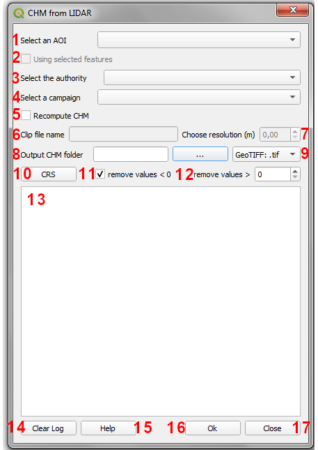
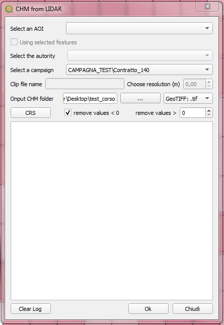
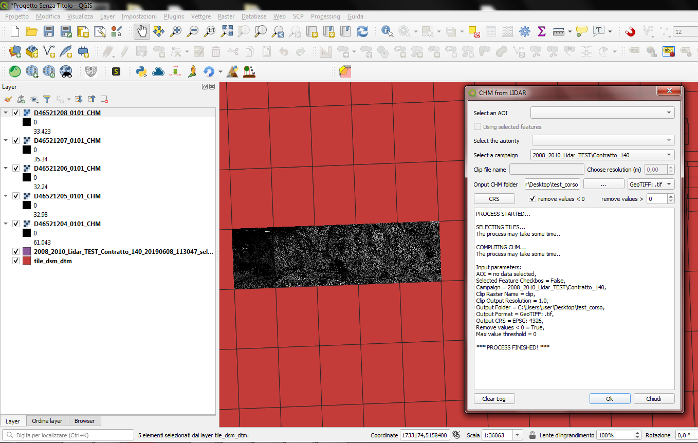
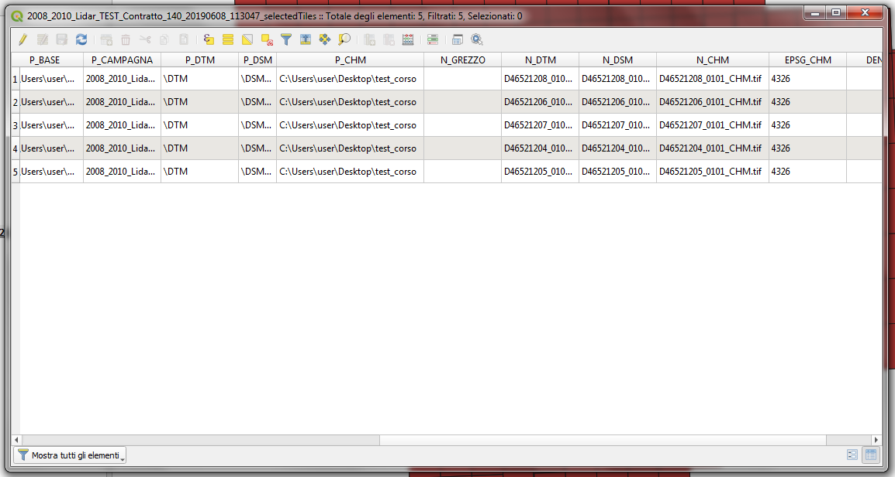
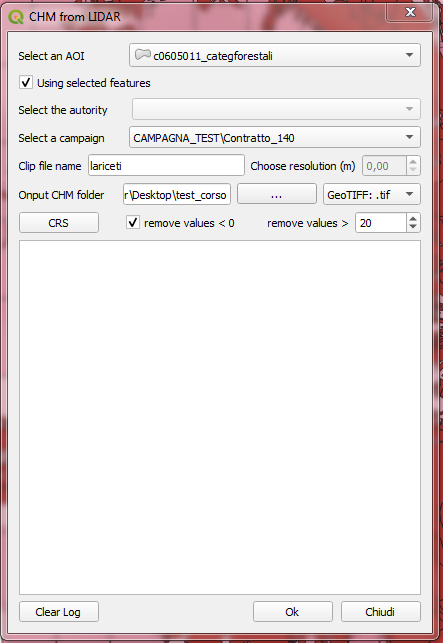
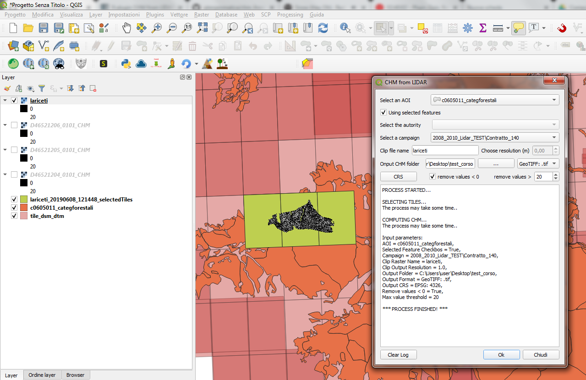

Il plugin CHM from LIDAR
==================================
Il Plugin CHM from LIDAR consente la generazione del Canopy Height Model (CHM) a partire da dati Lidar, in particolare DTM e DSM (First Impulse).

I principali input del plugin sono i file DSM e DTM derivanti dalle diverse campagne di volo, dai quali verrà calcolato il CHM, e un file vettoriale (formato GeoPackage) contenente le geometrie degli squadri (tile) che compongono le diverse campagne di rilievo. Di default questo file, nominato *tile_dsm_dtm.gpkg*, contiene le geometrie e le informazioni relative ai dati di Regione Veneto, che ha finanziato lo sviluppo del plugin. Ovviamente può essere modificato dall'utente inserendo i propri dati. Per la creazione ottimale di un nuovo file *tile_dsm_dtm.gpkg*, si raccomanda l'utilizzo del Plugin QGIS **Lidar Tile Maker** che è stato sviluppato appositamente per facilitare la creazione del file delle tile e di conseguenza facilitare l'utilizzo del Plugin CHM from LIDAR a tutti gli utenti. Il manuale del Plugin **Lidar Tile Maker** è disponibile a questo link: https://lidar-tile-maker-manuale.readthedocs.io/en/latest/

In file *tile_dsm_dtm.gpkg* viene automaticamente caricato all'interno del progetto QGIS all'avvio del plugin. Qualora invece fosse stato già caricato durante una sessione di lavoro precedente non sarà nuovamente caricato ma verrà semplicemente reso attivo quello già presente. Allo stesso modo, per utilizzare un file di tile creato con il Plugin Lidar Tile Maker sarà sufficiente caricarlo nel progetto Qgis prima di avviare il plugin CHM from LIDAR. In questo modo il plugin non aggiungerà quello di default ma renderà attivo quello creato con il Plugin Lidar Tile Maker.
Il layer vettoriale delle tile, nominato *tile_dsm_dtm*, contiene nella tabella alfanumerica associata tutte le informazioni necessarie al reperimento dei relativi file DSM e DTM per il calcolo del CHM (percorso ai file, nome del file, nome della campagna, sistema di riferimento, ecc.). Il plugin quindi, sulla base dei parametri di input richiesti dall'utente, sarà in grado di recuperare automaticamente i DSM e DTM delle tile selezionate leggendo tutte le informazioni necessarie (percorso + nome file) dalla tabella associata al file tile_dsm_dtm.

NB: non rinominare il layer *tile_dsm_dtm* all'interno del progetto QGIS, il plugin infatti lo richiama automaticamente ogni volta che viene attivato. Qualora si modificasse il nome del layer nel progetto, il plugin non lo riconoscerebbe più e lo ricaricherebbe all'interno del progetto stesso.

Il calcolo del CHM verrà automaticamente processato per tutte le tile selezionate secondo i parametri richiesti dall'utente. E' infatti possibile calcolare il CHM di ogni tile appartenente a una specifica campagna di volo, oppure per tutte le tile che intersecano un Area di Interesse (di seguito AOI) definita dall'utente.

Nel primo caso il CHM di ogni singola tile appartenente alla campagna selezionata sarà calcolato con formato e sistema di riferimento definiti dall'utente e salvato nella cartella di output anch'essa definita dall'utente. Nel secondo caso sarà calcolato il CHM di ogni singola tile che interseca l'AOI specificata e verranno salvati nella cartella di output definita dall'utente con formato e sistema di riferimento richiesto, inoltre verrà anche creato un file raster contenente il ritaglio (clip) dei CHM calcolati sulla boundary dell'AOI specificata. Anche il clip verrà salvato nella cartella di output definita dall'utente con nome, formato e sistema di riferimento desiderati.

Di seguito verranno meglio dettagliati tutte le possibili casistiche, i parametri definibili dall'utente e in generale il workflow del plugin CHM from LIDAR.

Caratteristiche e funzionamento
--------------------------------------------
Come già anticipato, lo scopo principale del plugin CHM from LIDAR è calcolare il CHM a partire dai dati Lidar (DSM e DTM) ottenuti dalle varie campagne di rilievo che si sono tenuto sul territorio. Il workflow generale del Plugin è composto da:

* Selezione delle tile dal layer vettoriale tile_dsm_dtm (che viene caricato e/o attivato automaticamente nel progetto QGIS all'avvio del plugin) che contiene appunto le tile di tutte le campagne effettuate sul territorio della regione Veneto. Le tile vengono selezionate sulla base dei parametri definiti in input dall'utente. Ad esempio scegliendo la sola campagna di volo verranno selezionate tutte le tile appartenenti a quella campagna, scegliendo una campagna e un'AOI verranno selezionate tutte le tile della campagna richiesta che intersecano l'area di interesse fornita in input. Nel caso in cui venga invece fornita dall'utente la sola AOI verranno selezionate tutte le tile che intersecano l'AOI a prescindere dalla campagna di volo a cui appartengono. In questo caso si potranno verificare diverse situazioni: tutte le tile selezionate appartengono a una sola campagna, le tile selezionate appartengono a campagne diverse ma non c'è sovrapposizione (tile adiacenti), le tile selezionate appartengono a campagne diverse e c'è sovrapposizione (es. campagne svolte in periodi diversi sulla stessa zona). Le tile selezionate verranno salvate su un nuovo layer vettoriale che, a seconda che si tratti di una selezione per sola campagna o per AOI, verrà nominato con il nome della campagna o del file clip oltre che alla data di creazione che permetterà di tenere traccia dei CHM calcolati in precedenza e delle aree di interesse che sono state scelte. Tutte le informazioni relative ai nuovi CHM creati (percorso di salvataggio, nome del file, formato e sistema di riferimento) saranno automaticamente aggiunte nella tabella del layer vettoriale generato dalla selezione delle tile.

* Calcolo del CHM per le tile selezionate. Il CHM viene calcolato per ogni singola tile selezionata. I file vengono salvati nella cartella di output definita dall'utente con formato e sistema di riferimento forniti dall'utente tramite il settaggio dei parametri di input dall'interfaccia grafica. In caso la selezione avvenga tramite un'AOI verrà anche generato un file con il ritaglio dei CHM generati sul confine dell'AOI selezionata.

* I risultati finali ovvero i CHM e il clip vengono automaticamente caricati all'interno del progetto QGIS.

Tutti i parametri di input necessari al calcolo del CHM sono settati dall'utente tramite l'interfaccia grafica del plugin che viene visualizzata clickando sull'icona presente nella toolbar una volta avvenuta l'installazione.

* **1 - Seleziona area di interesse:** da qui è possibile selezionare il layer vettoriale contenente le geometrie dell'are di interesse per la quale si desidera calcolare il CHM. Il menù a tendina elenca tutti i layer vettoriali caricati all'interno del progetto corrente, è quindi necessario che il vettoriale contenete l'AOI sia stato già caricato nel progetto Qgis.
* **2 - Usa solo le geometrie selezionate:** qualora il layer dell'AOI selezionato avesse geometrie selezionate la check box si attiva. Checkandola verranno quindi utilizzate le sole geometrie selezionate e quindi verranno selezionate tutte le tile (dal layer tile_dsm_dtm) che intersecano le sole geometrie selezionate nel layer di AOI selezionato al punto 1. Se la check box non viene spuntata verrà utilizzato per l'intersezione l'intero layer. Nel caso in cui nel layer di AOI selezionato non siano presenti geometrie selezionate la check box sarà disattivata.
* **3 - Seleziona ente:** tra le varie informazioni immagazzinate nella tabella del layer delle tile (tile_dsm_dtm) è presente anche l'Ente che ha gestito la campagna di volo. Il menù a tendina elenca tutti gli enti indicati all'interno della tabella, è possibile quindi selezionare l'ente desiderato e di conseguenza visualizzare nel menù a tendina, di cui al punto 4, le sole campagne di volo gestite dall'ente selezionato.
* **4 - Seleziona campagna:** sulla base dell'ente selezionato al punto 3, il menù a tendina elencherà tutte le campagne di volo gestite dall'ente. Sarà quindi possibile selezionare la campagna desiderata per la quale calcolare il CHM.
* **5 - Ricalcola i CHM:** qualora all'interno del layer delle tile (tile_dsm_dtm) venisse trovato percorso e nome (rispettivamente colonna P_CHM e N_CHM) di file CHM già calcolati, il plugin di default utilizza questi file per procedere con gli step successivi di calcolo (es. applicazioni di filtri su valori negativi e/o soglia sui valori massimi, riproiezione, conversione di formato, clip, ecc.) in base ai parametri di input definiti dall'utente. Ceckando la checkbox invece i CHM verranno ricalcolati, anche se già presenti nel layer delle tile, procedendo poi agli step successivi di calcolo in base ai parametri in input definiti dall'utente. Se invece non viene trovato il CHM corrispondente per le tile selezionate e la checkbox non è spuntata, il plugin ovviamente calcolerà il CHM corrispondente.
* **6 - Nome del file Clip:** selezionando un'are di interesse è necessario indicare un nome per il raster che conterrà il CHM ritagliato sul confine dell'area AOI selezionata. E' necessario indicare solo il nome senza l'estensione del file che verrà aggiunta automaticamente sulla base del formato di output scelto dall'utente. Qualora l'utente non indicasse il nome per il clip, il plugin restituirà un warning in cui si avvisa l'utente che verrà dato al file un nome di default (es. clip.*). **NB: non inserire nel nome del file spazi o caratteri speciali.**
* **7 - Scegli la risoluzione (m):** da qui è possibile selezionare la risoluzione, espressa in metri, con cui verrà ricampionato il file del clip. I CHM delle singole tile vengono infatti calcolati con la risoluzione originaria del DSM e DTM, mentre per quanto riguarda il clip è possibile appunto definire una risoluzione diversa da quella originaria. Il valore è espresso in metri. Qualora si volesse utilizzare un sistema di riferimento non proiettato (es. WGS84 con unità in gradi), la risoluzione deve essere comunque espressa in metri, sarà il plugin a convertire il valore fornito nell'unità di misura corrispondente al sistema di riferimento scelto. Qualora l'utente non specifichi un valore lasciando la box al valore di default (0.00), verrà utilizzata la risoluzione originaraia del DSM e del DTM per calcolare il clip. La box per la scelta della risoluzione si attiverà solo nel caso in cui venga selezionata la sola AOI, senza quindi selezionare una campagna specifica. Infatti qualora venga selezionata anche una campagna di volo la box sarà disattivata e il clip verrà restituito con la stessa risoluzione del CHM, ovvero quella originaria. NB: qualora l'utente definisse un valore di risoluzione inferiore a quello del dato di origine, il plugin restituirà un warning.
* **8 - Cartella di output:** premendo sul bottone (...) si aprirà una finestra di dialogo tipo esplora risorse da cui sarà possibile navigare all'interno della propria macchina e selezionare la cartella dentro cui si desiderano salvare tutti gli output del processo (CHM delle singole tile e clip). Una volta selezionata la cartella il percorso a questa comparirà nella stringa di testo accanto al bottone. NB: qualora l'utente non selezionasse una cartella di output il plugin restituirà un messaggio di errore, il processo verrà bloccato e l'utente avrà la possibilità di selezionare la cartella e successivamente rilanciare il calcolo.
* **9 - scelta del formato:** dal menù a tendina è possibile selezionare il formato di output con cui si vogliono salvare i risultati del processo, sia i CHM delle singole tile che il clip file. Di default il formato selezionato è il GeoTIFF.
* **10 - scelta del sistema di riferimento:** clickando sul bottone si aprirà la finestra di dialogo standard di Qgis per la scelta del sistema di riferimento. Di default il plugin utilizza il sistema di riferimento originario del DSM e DTM. Qualora invece l'utente selezionasse un sistema di riferimento diverso, gli output del processamento saranno riproiettati nel sistema di riferimento richiesto.
* **11 - rimuovi valori < 0:** la casella di controllo permette appunto di gestire l'eliminazione di eventuali valori negativi dal CHM. Se la casella è spuntata i valori negativi presenti nei CHM calcolati verranno posti uguali a 0. Di default la casella è già spuntata ma è sufficiente rimuovere la spunta per ottenere i CHM risultanti con il valore minimo effettivo quindi eventualmente comprensivo anche di valori negativi.
* **12- rimuovi valori > xx:** in questo caso inserendo un valore numerico intero nella box verranno eliminati dai CHM finali i valori maggiori del valore di soglia indicato. Come nel caso della soglia per i valori negativi, anche in questo caso tutti i pixel con valore maggiore di quello indicato verranno posti uguali al valore stesso. Di default il valore è 0, qualora l'utente non specifichi un valore di soglia diverso da quello di default, verrà restituito il CHM con i valori effettivi.
* **13 - Log:** in questa area compariranno durante il processo messaggi informativi sullo stato di avanzamento del processo. Qui appariranno anche eventuali messaggi di warning e di errore. Nel caso di warning si tratta solo di avvisi per l'utente che però non bloccano il processo, in caso di errori o problematiche di vario tipo verrà restituito un messaggio e l'utente potrà modificare l'impostazione dei parametri di input e successivamente rilanciare il processamento. Al termine del processo, qualora andato a buon fine, comparirà un messaggio contenente un riassunto di tutti i parametri di input indicati per il calcolo seguito dalla scritta 'Processo terminato'.
* **14 - Pulisci Log:** si tratta di un bottone che pulisce l'area di testo eliminando i messaggi relativi a un processamento precedente.
* **15 - Guida:** si tratta di un bottone che apre automaticamente il browser rimandando alla pagina web del manuale del plugin.
* **16 - OK:** è il pulsante che lancia l'intero processamento. Una volta definiti tutti i parametri in input l'utente clickando sul pulsante Ok darà avvio al processo vero e proprio. Come già anticipato al punto 12, in caso di messaggi di errore che richiedano da parte dell'utente un'ulteriore interazione con l'interfaccia grafica, sarà possibile andare a modificare i parametri necessari e successivamente clickare nuovamente il tasto ok per rilanciare il processamento.
* **17 - Chiudi:** l'interfaccia grafica del plugin resta aperta e attiva finchè l'utente non la chiuderà clickando sul tasto Close. In questo modo si chiuderà l'interfaccia grafica e tutti i vari parametri di input verranno ripristinati ai loro valori di default.

Esempi
--------------------------------------------

Scelta della sola Campagna di Volo
""""""""""""""""""""""""""""""""""""""""
Scegliendo la sola campagna di volo, viene calcolato il CHM per ogni tile appartenente alla campagna selezionata.

Nel caso della sola campagna di volo sono abilitate le funzioni che consentono:

* la scelta del formato file, 
* la scelta del sistema di riferimento,
* la rimozione dei valori negativi
* la rimozione dei valori sopra una certa soglia

Restano invece disabilitate le funzioni relative al clip e alla scelta della risoluzione con cui crearlo. Infatti non scegliendo un'area di interesse non verrà prodotto alcun ritaglio.

Clickando su OK si avvia il processo di calcolo

I CHM calcolati vengono automaticamente caricati nel progetto Qgis insieme al file vettoriale che contiene le tile per cui è stato calcolato il CHM. Aprendo la tabella di questo layer vettoriale, si nota che all'interno della colonna **P_CHM** è stato automaticamente inserito il percorso alla cartella in cui sono stati salvati i CHM, nella colonna **N_CHM** il nome dei file con relativa estensione del formato e nella colonna **EPSG_CHM** il codice EPSG del sistema di riferimento scelto.

Scelta di un'Area di interesse e della Campagna di Volo
""""""""""""""""""""""""""""""""""""""""""""""""""""""""""""""""""
In questo caso verranno calcolati i CHM per tutte le tile che intersecano l'area di interesse selezionata.

Se il layer selezionato come Area di Interesse contiene geometrie selezionate, si attiva la casella di controllo *'Usa solo le geometrie selezionate'*. Checkando la casella verranno utilizzate come area di interesse le sole geometrie selezionate, altrimenti l'intero layer.

Nel caso della scelta di un'AOI e della campagna di volo sono abilitate le funzioni che consentono:

* la scelta del formato file, 
* la scelta del sistema di riferimento,
* la rimozione dei valori negativi
* la rimozione dei valori sopra una certa soglia

Resta invece disabilitata la funzione per la scelta della risoluzione con cui creare il file clip, in questo caso infatti il clip verrà creato con la risoluzione originaria della campagna.

Clickando su OK si avvia il processo di calcolo

I CHM calcolati e il file clip vengono automaticamente caricati nel progetto Qgis insieme al file vettoriale che contiene le tile per cui è stato calcolato il CHM. Anche in questo caso aprendo la tabella di questo layer vettoriale, si nota che all'interno della colonna **P_CHM** è stato automaticamente inserito il percorso alla cartella in cui sono stati salvati i CHM, nella colonna **N_CHM** il nome dei file con relativa estensione del formato e nella colonna **EPSG_CHM** il codice EPSG del sistema di riferimento scelto.

Scelta della sola Area di interesse
""""""""""""""""""""""""""""""""""""
Si tratta del caso in cui l'utente voglia calcolare il CHM per una particolare area di interesse senza però conoscere la campagna o le campagne di volo che la intersecano. In questo caso si potranno verificare tre casistiche che il plugin gestirà in modo diverso:

* 1 - l'AOI interseca una sola campagna di volo: verranno calcolati i CHM di tutte le tile che intersecano l'AOI e verrà generato il clip. In questo caso verrà utilizzata la risoluzione e il sistema di riferimento originari dei dati qualora l'utente non ne abbia settati di diversi. 
* 2 - l'AOI interseca più campagne di volo non sovrapposte: verranno calcolati i CHM di tutte le tile che intersecano l'AOI e verrà generato il clip. In questo caso però verranno fatti in fase di calcolo due controlli, uno sul sistema di riferimento e uno sulla risoluzione. Qualora le campagne abbiano sistema di riferimento diverso il processo si bloccherà restituendo un messaggio di warning e verrà richiesto all'utente di selezionare un sistema di riferimento a meno che non sia stato già selezionato in fase di settaggio dei parametri in input. Qualora invece le campagne di volo abbiano risoluzione diversa e non sia stata definita una risoluzione in input, verrà presa di default quella maggiore.
* 3 - l'AOI interseca più campagne di volo sovrapposte: il processo si blocca e verrà restituito un messaggio con elencate alcune informazioni relative alle diverse campagne di volo (ente, nome della campagna, anno e risoluzione) e verrà richiesto all'utente di selezionare la campagna per la quale si vuole calcolare il CHM.
