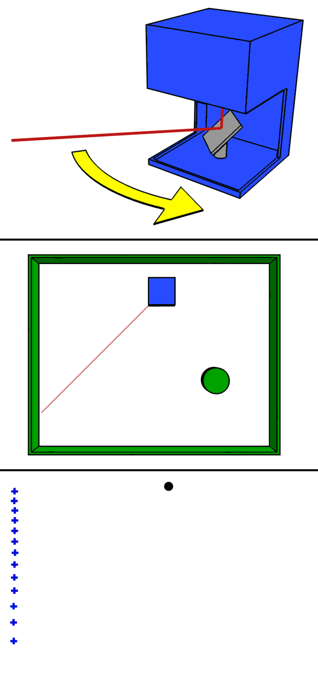

Cos'è la tecnologia LIDAR
===========================

Definizione
-------------------------------------------------------

Il LIDAR è una tecnologia attiva di *remote sensing* che consente di determinare la distanza di un oggetto o di una superficie utilizzando un impulso 
laser. 

E' definita una tecnologia *attiva* in quanto, a differenza di altre tecnologie di telerilevamento passive che sfruttano l'energia emessa dal sole 
(es. sensori ottici) emette una certa energia, sotto forma di un raggio laser, per rilevare la forma di oggetti. Nella fattispecie il lidar, a differenza di tecnologie simili quali il radar o il sonar, usa poca energia (da qui il termine *light* emettendo un laser con lunghezze d'onda ultraviolette, nel visibile o nel vicino infrarosso.

In rete si può trovare molto materiale sulla tecnologia LIDAR su sul sisto 'neon science_' (NEON: National Ecological Observatory Network). 
A titolo di esempio questo video vale molto più di mille parole per comprendere cosa sia il lidar, come funzioni e 
quali sono le principali applicazioni:

.. raw:: html

	

		<iframe src="https://www.youtube.com/embed/m7SXoFv6Sdc?list=PLiSjSway-kxAcenpAkPwWGy53RVnh3-r3&cc_load_policy=1&cc_lang_pref=en" frameborder="0" allow="accelerometer; autoplay; encrypted-media; gyroscope; picture-in-picture" allowfullscreen style="position: absolute; top: 0; left: 0; width: 100%; height: 100%;"></iframe>
	

	
"""""""""""""""""""""""""""""""""""""""""""""""

Come funziona il lidar?
-----------------------------------------------------
Di fatto il lidar misura il tempo con cui un'onda emessa ritorna alla sorgente dopo essere stata riflessa e, sulla base di questo tempo, è in grado di misurare la distanza.

Fonte: Mike1024_ via Wikimedia Commons

.. _Mike1024: https://commons.wikimedia.org/wiki/File:LIDAR-scanned-SICK-LMS-animation.gif

Grazie all'uso combinato con GPS e IMU è in grado di convertire una misura della distanza con la quota di un oggetto sul terreno.

In realtà  l'impulso emesso dal laser genera più di una risposta nel tempo, meglio definita con il termine inglese *pulse* o impulso. Graficando il tempo impiegato da ciascun fascio emesso per tornare al sensore e l'energia si possono individuare diversi picchi (definiti appunto *pulse*) che permettono di individuare al meglio la forma degli oggetti presenti sul terreno.

Un esempio di risposta letta dal sensore lidar è mostrata nella seguente figura:

.. image:: img/waveform.png

Source: NEON, Boulder, CO.

Usando quindi i dati LIDAR grezzi si possono ricavare diversi indici e classificare accuratamente il terreno. A titolo di esempio ecco alcuni indici: 

* Canopy Height
* Canopy Cover
* Leaf Area Index
* Vertical Forest Structure

Si può addirittura arrivare all'identificazione delle singole specie, anche se solo in foreste poco dense e disponendo di un'alta densità di punti

.. _neon science: https://www.neonscience.org/

Dal processamento dei dati LIDAR ai GIS
-------------------------------------------------------

Il risultato *grezzo* di un rilievo LIDAR è una nuvola di punti (dense cloud) che come detto è opportunamente classificabile.

Archiviazione del dato in formato vettoriale (all, xyz, txt, las) o raster (asc, tif)
'''''''''''''''''''''''''''''''''''''''''''''''''''''''''''''''''''''''''''''''''''''''''''
 
I prodotti più comuni di un rilievo LIDAR possono però essere dei dati raster (vedi immagine) ossia dati composti da matrici di celle 
(chiamati anche pixel), ciascuna contenente un valore che rappresenta le condizioni dell’area coperta dalla cella 
(in questo caso l'altezza del terreno).

.. image:: img/raster.png

Una griglia RASTER in ambiente GIS può essere disponibile in una molteplicità di formati gestiti dalla libreria GDAL. Sicuramente i più comuni sono: 

* formato ASCII
* formato GeoTIFF

Una lista di tutti i possibili formati raster GDAL è disponibile a questo indirizzo: https://gdal.org/drivers/raster/index.html

In alcuni casi, al posto di una griglia raster è possibile che i risultati del rilievo LIDAR siano forniti in formato vettoriale: 

* formato ALL
* formato LAS
* formato TXT
* formato XYZ

In tutti i casi si tratta in realtà di file che conterranno le coordinate dei punti del centro di ogni cella e il valore in quota della cella che si leggerebbe anche sul file raster. 
**In tali casi si consiglia di procedere ad un'immediata interpolazione alla risoluzione desiderata in quanto tali file non possono supportate le operazioni di raster algebra oggetto del presente tutorial**.

Sistemi di riferimento (geografiche o proiettate, classificazione  EPSG)
'''''''''''''''''''''''''''''''''''''''''''''''''''''''''''''''''''''''''''''''''''''''''''

A questo punto è bene fare una breve panoramica dei CRS (Coordinate Reference System) disponibili in ambiente GIS

Infatti, nell’utilizzo dei software GIS la gestione dei Sistemi di coordinate geografici o cartografici, che nel seguito indicheremo
con l’acronimo inglese CRS (Coordinate Reference System), è sempre un aspetto complesso per l’utente. 

I datum geodetici con i quali sono distribuiti i dati geografici nel nostro paese sono infatti almeno 5 (tabella 1) 
e se ad essi si aggiungono le proiezioni cartografiche i CRS diventano più del doppio (tabellla 2). 

+------------------------+----------------+--------------------------------------------------------------------+ 
|Datum geodetico         |  Codice EPSG   | Note                                                               |
+========================+================+====================================================================+
| **ETRF2000 (RDN 2008)**| **6706**       | **Realizzazione italiana del sistema globale ETRS89**              |
+------------------------+----------------+--------------------------------------------------------------------+
| ETRF89/ETRS89          | 4258           |                                                                    | 
+------------------------+----------------+--------------------------------------------------------------------+
| ED50                   | 4230           |                                                                    |
+------------------------+----------------+--------------------------------------------------------------------+
| Roma40 Monte Mario     | 4265           | Longitudini espresse rispetto al meridiano di Greenwich            |
+------------------------+----------------+--------------------------------------------------------------------+
| Roma40 Monte Mario     | 4806           | Longitudini espresse rispetto al meridiano Monte Mario             |
+------------------------+----------------+--------------------------------------------------------------------+
|                        |                | Secondo l’IGM non dovrebbe essere utilizzato per la cartografia    |
| WGS84                  | 4326           | ufficiale di fatto è molto usato a livello internazionale per      |
|                        |                | dati che non richiedano elevata precisione                         |
+------------------------+----------------+--------------------------------------------------------------------+

Tabella 1 - Principali sistemi di coordinate geografiche (lat/lon) usati in ambiente GIS in Italia. 
In grassetto quello “ufficiale”

+---------------------------+----------------+-----------------------------------------------------------------+ 
|Datum geodetico            |  Proiezione    | Codice EPSG                                                     |
+===========================+================+=================================================================+
| ETRF 2000 (RDN 2008)      | UTM 32N        | 7791 (6707)                                                     |
+---------------------------+----------------+-----------------------------------------------------------------+
| ETRF 2000 (RDN 2008)      | UTM 33N        | 7792 (6708)                                                     |
+---------------------------+----------------+-----------------------------------------------------------------+
| ETRF 2000 (RDN 2008)      | UTM 34N        | 7793 (6709)                                                     |
+---------------------------+----------------+-----------------------------------------------------------------+
| ETRF 2000 (RDN 2008)      | Fuso italia1   | 7794 (6875)                                                     |
+---------------------------+----------------+-----------------------------------------------------------------+
| ETRF 2000 (RDN 2008)      | Zona 12        | 7795 (6876)                                                     |
+---------------------------+----------------+-----------------------------------------------------------------+
| ETRF89/ETRS89             | UTM 32N        | 25832                                                           |
+---------------------------+----------------+-----------------------------------------------------------------+
| ETRF89/ETRS89             | UTM 33N        | 25833                                                           |
+---------------------------+----------------+-----------------------------------------------------------------+
| ETRF89/ETRS89             | UTM 34N        | 25834                                                           |
+---------------------------+----------------+-----------------------------------------------------------------+
| ED50                      | UTM 32N        | 23032                                                           |
+---------------------------+----------------+-----------------------------------------------------------------+
| ED50                      | UTM 33N        | 23033                                                           |
+---------------------------+----------------+-----------------------------------------------------------------+
| ED50                      | UTM 34N        | 23034                                                           |
+---------------------------+----------------+-----------------------------------------------------------------+
| Roma40 Monte Mario (4265) | Fuso Ovest     | 3003                                                            |
+---------------------------+----------------+-----------------------------------------------------------------+
| Roma40 Monte Mario (4265) | Fuso Est       | 3004                                                            |
+---------------------------+----------------+-----------------------------------------------------------------+
| WGS84                     | UTM 32N        | 32632                                                           |
+---------------------------+----------------+-----------------------------------------------------------------+
| WGS84                     | UTM 33N        | 32633                                                           |
+---------------------------+----------------+-----------------------------------------------------------------+
| WGS84                     | UTM 34N        | 32634                                                           |
+---------------------------+----------------+-----------------------------------------------------------------+

Tabella2 –  Principali sistemi di coordinate cartografiche (est/nord) usati in ambiente GIS in Italia. I codici EPSG tra parentesi sono codici caratterizzati dagli stessi parametru (datum geodetico e proiezione) se non per l'ordine degli assi che è N-E e non lo standard E-N

La convinzione più comune è che il CRS Roma40 Monte Mario, con proiezione Gauss Boaga (EPSG 3003 e 3004) sia il sistema di riferimento ufficiale, 
quasi fosse l’unico esistente ed utilizzabile in ambiente GIS. In realtà l'IGM ha stabilito come sistema ufficiale l'ETRF2000 
con la sua materializzazione del 2008 (Rete Dinamica Nazionale - RDN) con le rispettive proiezioni che variano regione per regione.

Per molte regioni per esempio la suddivisione proposta dai fusi UTM (32, 33 e 34 N) va benissimo

Si è poi definita una proiezione (Fuso Italia) che introduce un fattore di contrazione per minimizzare le deformazioni sull'intero territorio nazionale

E infine, Regione Veneto, a cui si riferiscono i dati di questo tutorial, che come altre regioni risulta a cavallo fra i fusi UTM e al contempo penalizzata dalla definizione del fuso Italia e dal fattore di contrazione, ha proposto un'ulteriore proiezione (Fuso 12) 
in grado di minimizzare le deformazioni 

Regione Veneto usa quindi come CRS ufficiale il CRS **ETRF2000 (RDN 2008) - Zona 12 (EPSG 7795)**

Normalmente le trasformazioni tra sistemi di coordinate avvengono in ambito GIS tramite operazioni di roto-traslazioni 
gestite sulla base dei parametri definiti attraverso i codici EPSG, tuttavia queste operazioni valide su tutto il territorio nazionale 
portano ad imprecisioni dell’ordine metrico. 
Per la maggior parte dei dati territoriali si tratta pertanto di errori inferiori all’errore di graficismo, quindi del tutto trascurabili. 
Tuttavia al crescere della scala del dato diventa importante assicurare precisioni più elevate. 
In questi casi esistono le cosiddette materializzazioni dei sistemi di riferimento. Si tratta di una rete di punti per cui si conoscono 
le coordinate nei vari sistemi di riferimento e che quindi consentono di definire trasformazioni più precise. 
A partire dalle materializzazioni dei sistemi di riferimento, l’IGM mette a disposizione i cosiddetti *grigliati*.

Si tratta di griglie a passo regolare che contengono le differenze, espresse in coordinate geografiche, fra i vari sistemi di coordinate 
e consentono in tal modo di correggere i normali algoritmi di trasformazione.

La componente altimetrica, quando parte della componente geometrica del dato numerico, è anch’essa trattata attraverso apposite griglie
che contengono in tal caso i valori delle separazioni fra geoide nazionale e l’ellissoide GRS80 (adottato nel sistema ETRS89), che consentono,  con una procedura analoga a quella della planimetria, di trasformare le quote ellissoidiche in quote geoidiche (sul livello del mare), relative ai riferimenti altimetrici nazionali, e viceversa. Ad oggi l’IGM dispone di due modelli di geoide, entrambi realizzati in collaborazione  con il Politecnico di Milano: ITALGEO99 e ITALGEO2005, caratterizzati da uno scostamento medio rispetto alle linee di livellazione di alta precisione  di ± 0.16 e ± 0.04 m rispettivamente.
 
 
L’IGM distribuisce pertanto 3 tipi di grigliati:

* Grigliato GK1 che integra il modello di geoide ITALGEO99 (file in formato .gk1);
* Grigliato GK2 che integra il modello di geoide ITALGEO2005 (file in formato .gk2);
* Grigliato NTv2 che consente trasformazioni solo planimetriche (file in formato .gsb).

I grigliati GK sono disponibili in due tagli: il primo con copertura pari a quella dei fogli della carta d'Italia alla scala 1:50.000 
(circa 600 km2); il secondo come intorno dei punti IGM95 (circa 300 km2). 

I grigliati Ntv2 sono invece disponibili per superfici specifiche richieste dall'utente indicando le coordinate dei vertici NE e SO
dell' area di interesse e hanno un costo a Km². Si noti che i formati GK1 e GK2 non sono uno standard internazionale, ma una definizione italiana, mentre il formato Ntv2 è uno standard ed è supportato dalla libreria PROJ4.

I grigliati Ntv2 possono quindi essere usati, su QGIS per convertire i dati da un sistema all'altro. 
L'IGM fornisce i dati per effettuare le conversioni:

* da datum Roma40 (4265) a:
   * ETRF2000: file di tipo *XXX_XXX_R40_F00.gsb*
   * ETRS89: file di tipo *XXX_XXX_R40_F89.gsb*
   * ED50: file di tipo *XXX_XXX_R40_E50.gsb*

e su richiesta le griglie inverse. 

In sostanza però, a seconda della conversione che si vuole fare, disponendo del grigliato occorre seguire 
i seguenti passi:

1) copiare il file .gsb con i grigliati nelle cartella di sistema usata da QGIS (su windows per esempio è la cartella C:\\OSGeo4W64\\share\\proj oppure C:\\Program Files\\QGISX.X.X\\share\\proj)
2) definire un nuovo CRS customizzato: Settings → Custom projections (Impostazioni → Proiezione personalizzata) 

Si tratta di:
	- assegnare un nome al nuovo CRS
	- copiare i parametri del sistema di partenza (si può usare l’apposito tasto) e aggiungere l’opzione +nadgrids=nomefile.gsb
	
A titolo di esempio, volendo convertire i dati da Roma40 a ETRF2000 si dovrà usare un grigliato del tipo R40_F00 e modificare pertanto il SR di partenza (es. EPSG 3003) aggiungendo le informazioni con il grigliato.
       
	
	Proj4: +proj=tmerc +lat_0=0 +lon_0=9 +k=0.9996 +x_0=1500000 +y_0=0 +ellps=intl +towgs84=-104.1,-49.1,-9.9,0.971,-2.917,0.714,-11.68 +units=m +no_defs
	
	
	diventa
	
	
	Proj4: +proj=tmerc +lat_0=0 +lon_0=9 +k=0.9996 +x_0=1500000 +y_0=0 +ellps=intl +nadgrids=44301020_46501320_R40_F00.gsb +units=m +no_defs
	

Nell'immagine sottostante un esempio della finestra mostrata per la definizione del nuovo SR

 
 
 

Elaborazione dei dati – DSM, DTM – Ground,  OverGround -  First Point, Last Point
'''''''''''''''''''''''''''''''''''''''''''''''''''''''''''''''''''''''''''''''''''''''''''

In sostanza, spesso i dati LIDAR vengono restituiti sulla base di prodotti topografici comunemente noti come:
 
* il DSM ottenuto invece con il primo impulso ricevuto (DSMFirst) e in taluni casi quello ottenuto con l'ultimo impulso.
* il DTM ottenuto dall'ultimo impulso che raggiunge il terreno nudo. 

Sono questi prodotti facilmente consultabili con qualunque software GIS. 

A titolo di esempio ecco una tile del DSM (DSMFirst) di Regione Veneto nei pressi di Cortina d'Ampezzo:

.. image:: img/dsm_tile.png

Ed l'analoga tile con il DTM:

.. image:: img/dsm_tile.png

In questa GIF animata è rappresentato sinteticamente il processamento dei dati LIDAR che consente di ottenere prodotti raster a risoluzioni differenti.

.. image:: img/gridding.gif

Calcolo del CHM in ambiente GIS
-------------------------------------------------------

A partire da dati raster GIS come il DTM e il DSM può essere nuovamente ricavato il CHM come risultato 
della sottrazione fra DSM e DTM.

.. image:: img/lidarTree-height.png

Note sul calcolo del CHM
-------------------------------------------------------
Il CHM così calcolato ovviamente include tutti gli elementi presenti sul terreno incluso ovviamente l'edificato. 

A tal proposito in alcuni casi viene fornito sia il DSMFirst che il DSMLast le cui differenze sono pressochè nulle in corrispondenza dell'edificato,
più consistenti in corrispondenza di vegetazione.

A titolo di esempio si riportano 2 diversi profili realizzati confrontando DSMFirst, DSMLast e DTM per una tile sul centro di Vicenza (Regione Veneto)

* il primo caso è stato realizzato in centro, nei pressi del palazzo comunale e della famosa basilica Palladiana (Link OpenStreetMap: https://osm.org/go/0IBaN62IU--?m=)

.. image:: img/cfr_edifici.png

* il secondo caso è stato realizzato nei pressi della stazione confrontando un area a parco urbano con gli edifici della stazione ferroviaria (Link OpenStreetMap:https://osm.org/go/0IBaM4VaZ--?m=)

.. image:: img/cfr_alberi_stazione.png

Si può notare come:

* la differenza tra DSM e DTM includa ovviamente sia l'edificato che la vegetazione e quindi vada usata con cautela per applicazioni forestali
* la disponibilità di altri prodotti (es. DSMLast e DSMFirst) possa in qualche modo aiutare l'utente nell'analisi e classificazione dei prodotti ottenuti

