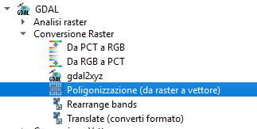

Classificazione dei risultati e vettorializzazione
=======================================================

Una volta ottenuto il CHM possono essere necessarie alcune operazioni di diverso tipo per ottenere dei risultati più utili a chi si occupa di pianificazione:

* filtraggio o smoothing del CHM ottenuto
* riclassificazione del raster ottenuto 
* eventuale vettorializzazione del risultato 

Filtraggio o smoothing
-------------------------------------

Per effettuare tale operazione possono, per esempio essere utili 2 tipi di filtri:

* **filtro gaussiano**: dove ogni pixel viene rimpiazzato dalla media pesata dei pixels in un suo intorno, secondo una funzione Gaussiana. Su QGIS è disponibile tramite un modulo di SAGA GIS, altro GIS open source 

* **gdal_sieve (o filtro gdal)** che consiste in uno script che rimuove piccoli poligoni di dimensioni inferiori a un valore di threshold, espresso in numero di celle. Tali valori vengono rimpiazzati con il valore del pixel del poligono più vicino

Riclassificazione
-------------------------------------
La riclassificazione può essere svolta con:

* l'apposito comando di QGIS (disponibile dalla versione 3.X)
.. image:: img/tabella_riclassificazione.PNG
* il comando GRASS r.reclass usando come input un file di testo con il seguente formato

0  thru  1.99 =  0

2  thru  4.99 =  2

5  thru  9.99 =  5

10 thru 14.99 = 10

15 thru 19.99 = 15

20 thru 24.99 = 20

25 thru 29.99 = 25

30 thru 100.0 = 30

* il comando GRASS r.recode usando come input un file di testo con il seguente formato

0:2:0:0

2:5:2:2

5:10:5:5

10:15:10:10

15:20:15:15

20:25:20:20

25:30:25:25

30:60:30;30

A titolo di esempio si riporta una semplicissima riclassificazione su un CHM non filtrato con una tabella semplificata: 

* **0-2 metri** : no vegetazione
* **2-5 metri** : chioma bassa
* **5-7 metri** : chioma media
* **>7 metri** : chioma alta

In immagine si possono visualizzare i risultati della riclassificazione sovrapposti all'ortofoto regionale (2015) 

.. image:: img/chm_riclassificato_no.png

Eventuale vettorializzazione
-------------------------------------
Si può infine procedere alla vettorializzazione:

Altri comandi utili post vettorializzazione potrebbero essere: 

* strumento per riparare le geometrie ottenute dalla vettorializzazione del raster

* un'estrazione dei valori >0 (per eliminare le aree senza alberi)

* comando v.clean di GRASS

